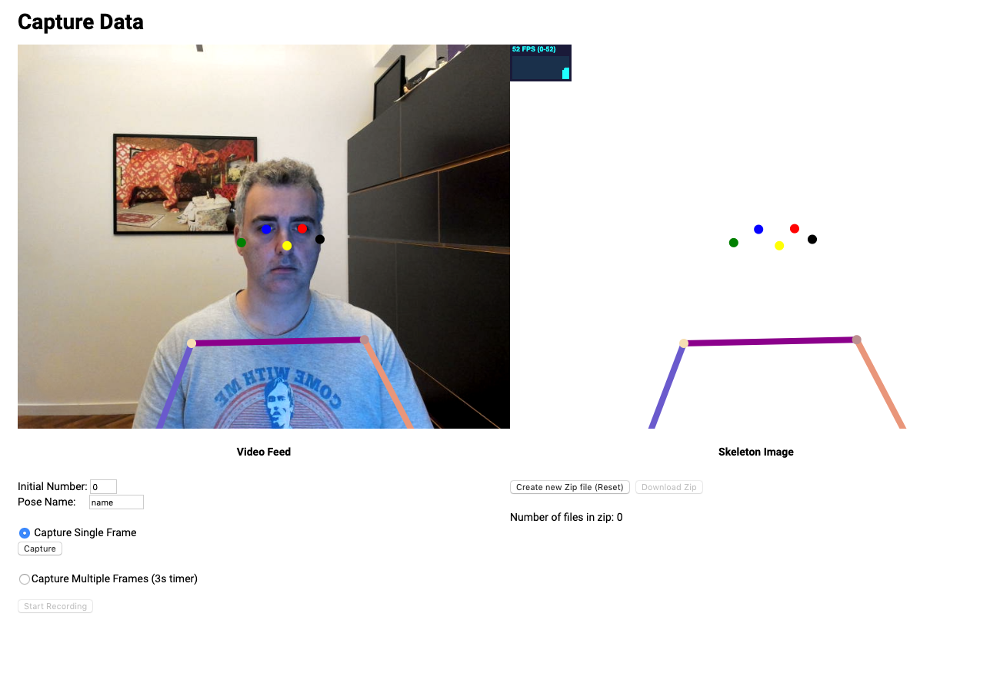

# Huia Experience - 01 Capturing Data

I created a simple Javascript app to capture images from the webcam. Instead of capturing the raw video feed, we are processing it with [TensorflowJS Posenet model](https://github.com/tensorflow/tfjs-models/tree/master/posenet) to do feature extraction and use this data to get the skeleton keypoints. We will be plotting the skeleton image (on the right) and save that image as well as the keypoints to train our model for pose recognition.

# Learn more about this project

Read my [medium article](https://medium.com/@alessandrocauduro/creating-an-interactive-artificial-intelligence-experience-on-the-browser-with-tensorflow-ea205ee08c02) about this project to learn about all the details necessary to build an artificial intelligence experience on the browser from end-to-end.

# How to install and run

You will need [NodeJS](https://nodejs.org/) >= 8.9 and [Yarn](https://yarnpkg.com/) >=1.15 installed.


Go to the directory **/01_capture** and run the following commands.
``` bash
# change to this folder
$ cd 01_capture 

# install modules 
$ yarn

# start node server
# this will also open your browser on http://localhost:1234/
$ yarn watch   
```

# Capturing Data for Training



Everytime you click the **Capture** button, it will generate and save a PNG image of the current *Skeleton Image*. It uses the *Pose Name* and *Initial Number* to name it as: 
- **POSENAME_NUMBER.png**, e.g. fly_0.png

After you finishing capturing the images, you can download them by clicking on the **Download Zip** button. If you need to start from scratch, just click **Create New Zip file**.

I also included a timer feature that will take capture an image every 3 seconds until you tell it to stop. Just select the **Capture Multiple Frames** option. This is useful when you are alone and need to do self capturing of poses :-)

Everytime you capture an image, a thumbnail will show up with the file name. 

If you need to continue later, you can change the Initial Number, so that you don't have files with the same names.

# Zip File Structure

We save our captured images into the folder **/02_train/training_data** that will later be used to train our Neural Network model for pose detection.


For example, for the poses **jump** and **run** it would look something like this:
```
\training_data
    \images
        \jump_1.png
        \jump_2.png
        ...
        \run_1.png
        \run_2.png
        ...
    \json
        \jump_1.json
        \jump_2.json
        ...
        \jump_1.json
        \jump_2.json
        ...
        ... etc
```