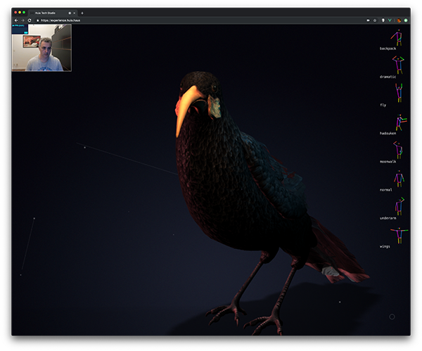
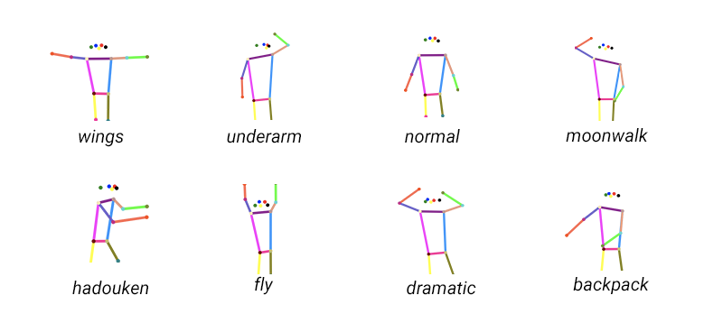

# Huia Experience

[Huia](https://huia.haus) is a Design & Tech Studio from Brazil and also the name of a rare and extinct bird from New Zealand. This project uses Artificial Intelligence and 3D to digitally recreate an interactive Huia. Using computer vision we map webcam images to understand the user's pose in real time and trigger fun actions.

# Try out the Live Demo

[https://experience.huia.haus](https://experience.huia.haus)

These are the poses the Huia responds to

Me trying out the experience at an event and having fun!

# Learn more about this project

Read my [medium article](https://medium.com/@alessandrocauduro/creating-an-interactive-artificial-intelligence-experience-on-the-browser-with-tensorflow-ea205ee08c02) about this project to learn about all the details necessary to build an artificial intelligence experience on the browser from end-to-end.

The project is divided into 3 parts:

- [01 Capturing Data](./01_capture/)
- [02 Training](./02_train/)
- [03 Interactive Experience](./03_experience/)

# Technical Details
This project was created with 
- [VueJS](http://vue.js)
- [ThreeJS](http://three.js) 
- [Tensorflow 2 Alpha](http://tensorflow.org/) and [TensorflowJS](http://tensorflow.org/js)

# This project was made possible with the help from:
- **Artificial Intelligence:** Alessandro Cauduro
- **Art Direction & Design:** Caio Ogata and Carolina Dutra Silveira
- **3D Modeling and Animations:** Funn
- **3D Interactive Huia**: Luiz Sordi
- **Docker and Site Infrastructure**: Mauricio Klagenberg
- **Body Data used for pose training:** Alessandro Cauduro, Carolina Dutra Silveira, André Gonçalves, Mauricio Klagenberg and Paulo Araújo.